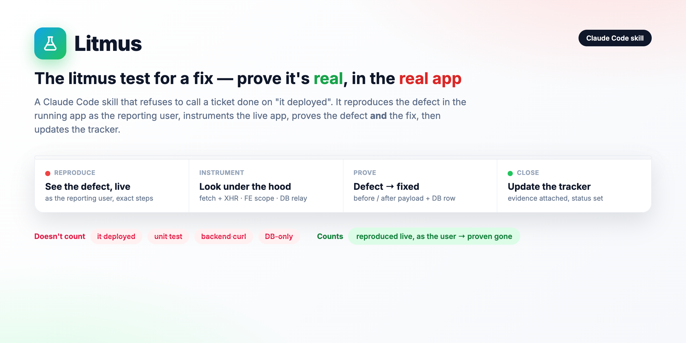

<div align="center">

# 🧪 Litmus

**The litmus test for a fix — prove it's real, in the real app.**



[](https://code.claude.com/docs/en/plugins)


</div>

A Claude Code skill that enforces one rule:

> **A ticket isn't "done" until you've reproduced the defect in the *running app* — and watched it disappear.**

"It deployed." A green unit test. A backend `curl`. A row in the DB. None of those count. Litmus is the
discipline that closes the gap between *"I changed the code"* and *"the user's problem is actually gone."*

## Why it exists

"Fixed" too often means *"I edited the code and it deployed"* — then QA reopens it. Litmus drives the
**real app as the reporting user**, reproduces the exact ticket steps, instruments the live
request/response + front-end state + database, and only updates the tracker when it can show the defect
**and** its absence, with evidence.

## What `/litmus` does

1. **Read the ticket** — user, steps, *actual*, *expected*, screen URL.
2. **Open the app as that user** — via the app's own "sign in as" (*you* type the password — never the skill).
3. **Reproduce** the exact steps; screenshot the failing state; confirm it matches *actual*.
4. **Instrument the live app** — hook **both** `fetch` *and* `XHR`, read front-end scope (e.g. AngularJS),
   query the DB through a relay with a real driver.
5. **Prove defect → fix** with concrete before/after: the payload now carries the right value · the list
   is de-duped · the exact DB row is correct.
6. **Update the tracker** with the evidence — then revert any test data and tear down relays.

## What it refuses to do — by design

- ❌ Close a ticket on deploy / unit-test / DB-only evidence
- ❌ Type or submit your password (you do that)
- ❌ Make destructive shared-data changes without a backup **and** a human's OK
- ❌ "Fix" an access gap by changing permissions itself — it flags it instead

## Install

```
/plugin marketplace add https://github.com/hacka0wi/Litmus
/plugin install litmus@litmus
```

After install, `/litmus` is available in **every project / session** and auto-triggers when you're about
to verify or close a ticket — or just say *"verify this"*, *"prove it's fixed"*, *"reproduce it live"*.

**Update:** `/plugin marketplace update litmus` (bump `version` in both manifests on changes).

## Field-tested gotchas (baked into the skill)

- Hook **both** `fetch` and `XHR` — an XHR-only hook misses modern SPA calls.
- Trust the **live** DB definition of procs/functions as canonical, not the repo `.sql`, if your team
  edits the DB directly.
- Verify counts/dups from **front-end state**, not the paginated rendered list.
- Confirm the deployed code actually contains the fix (`fn.toString().includes('…')`) — not just that it shipped.

## Structure

```
.claude-plugin/marketplace.json       # marketplace manifest (name: litmus)
plugins/litmus/
  .claude-plugin/plugin.json           # plugin manifest
  skills/litmus/SKILL.md               # the /litmus skill (generic — no secrets)
```

> Environment specifics (hosts, credentials, tracker ids, DB relays) are intentionally **not** in this
> public skill — keep them in your own private config / agent memory.

---
<div align="center"><sub>Built with Claude Code · MIT</sub></div>
